# Tugas Praktikum { Pertemuan ke 5 } 
|**Nama**|**NIM**|**Kelas**|**Matkul**|
|----|---|-----|------|
|Muhammad Ikhsan Fakhrudin|312210019|TI.22.A2|Basis Data|

**1. Buat sebuah database dengan nama latihan 2**

Untuk membuat database gunakan perintah sebagai berikut :

`CREATE DATABASE [nama_database]`

`CREATE DATABASE latihan2;`

lalu, setelah kita membuat database. kita masuk kedalam database tersebut dengan perintah sebagai berikut :

`USE latihan2;`

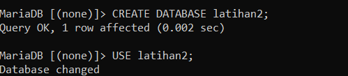

**2. Buat sebuah tabel dengan nama biodata (nama, alamat) didalam database latihan2!**

Untuk membuat Tabel gunakan perintah sebagai berikut :

`CREATE TABLE nama_tabel (nama_field1 tipe _data(ukuran), nama_field2 tipe_data(ukuran), ..., nama_fieldn tipe_data(ukuran));`

`CREATE TABLE biodata (nama VACHAR (15), alamat TEXT);`

**3. Tambahkan sebuah kolom keterangan (varchar 15), sebagai kolom terakhir!**

Untuk menambahkan kolom terakhir yaitu dengan sering digunakan kata AFTER, contoh :

`ALTER TABLE biodata ADD COLUMN keterangan VARCHAR (15) AFTER phone;`

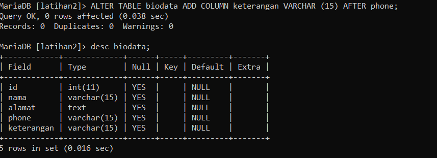

**4.Tambahkan kolom id(int 11) di awal (sebagai kolom pertama)!**

Untuk menambahkan kolom pertama yaitu dengan perintah sebagai berikut :

`ALTER TABLE biodata ADD COLUMN id int(11) FIRST; `

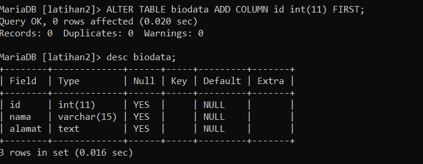

**5. Sisipkan sebuah kolom dengan nama phone (varchar 15) setelah kolom alamat!**

Untuk menambahkan kolom setelah kolom lain yaitu dengan perintah `AFTER`

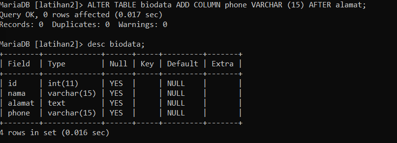

**6. Ubah tipe data kolom id menjadi char(11)!**

Untuk mengubah type data yaitu dengan perintah sebagai berikut :

`ALTER TABLE [nama_tabel] MODIFY nama_field tipe_data_baru(ukuran);`

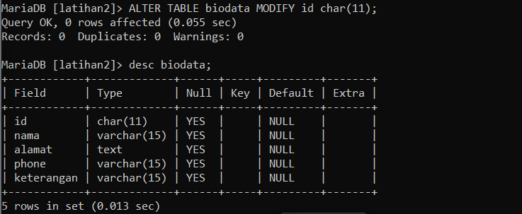

**7. Ubah nama kolom phone menjadi hp (varchar 20)!**

Untuk mengubah kolom yaitu dengan perintah sebgai berikut :

`ALTER TABLE [nama_tabel] CHANGE nama_field_lama nama_field_baru tipe_data(ukuran);`

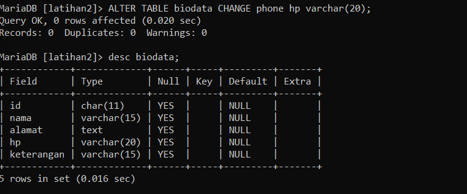

**8. Tambahkan kolom email setelah kolom hp**

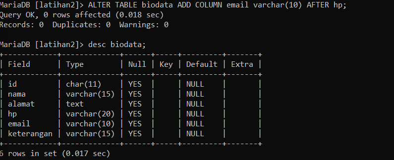

**9. Hapus kolom keterangan dari tabel!**

Untuk menghapus kolom dari tabel yaitu dengan perintah sebagai berikut :

`ALTER TABLE [nama_tabel] DROP nama_field;`

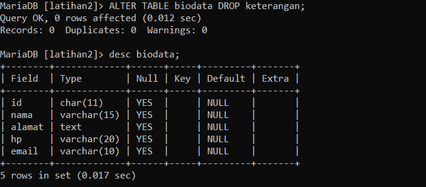

**10. Ganti nama tabel menjadi data_mahasiswa!**

Untuk mengganti nama tabel yaitu dengan perintah sebagai berikut :

`ALTER TABLE [nama_tabel] RENAME [nama_tabel_baru];`

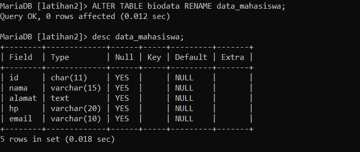

**11. Ganti nama field id menjadi nim!**

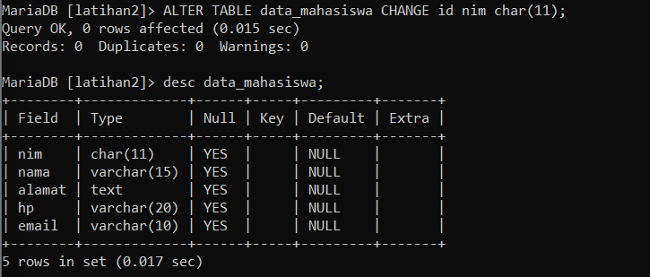

**12. Jadikan nim sebagai PRIMARY KEY!**

Untuk menambahkan index atau key, gunakan perintah sebagai berikut :

tipe index :

- PRIMARY KEY
- UNIQUE KEY
- FULLTEXT

`ALTER TABLE [nama_tabel] ADD [INDEX|PRIMARY KEY] (nama_field);`

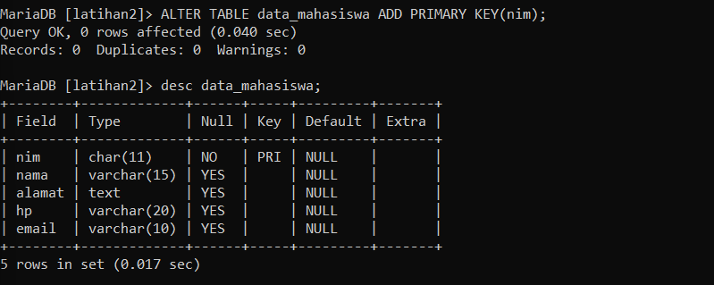

## 13. Jadikan kolom email sebagai UNIQUE KEY!

Perintah nya sama seperti diatas, hanya saja diganti menjadi `UNIQUE KEY`

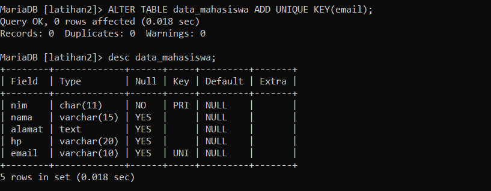

