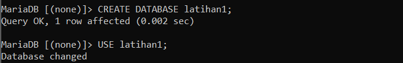
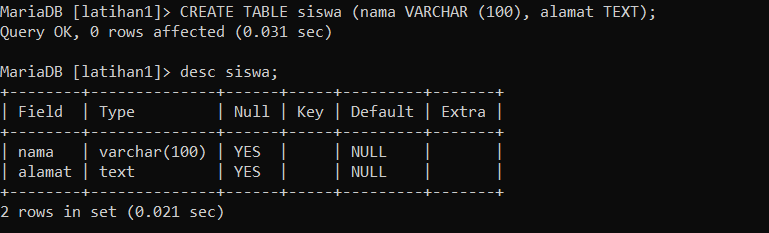
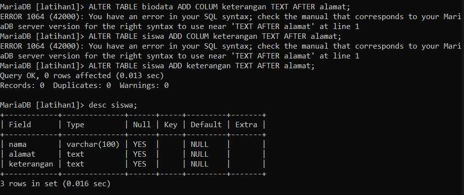
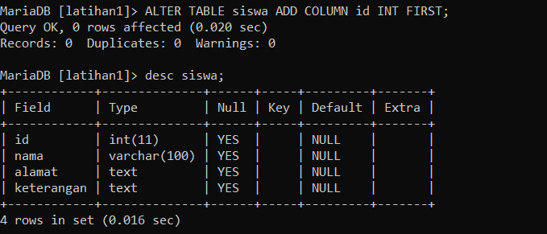
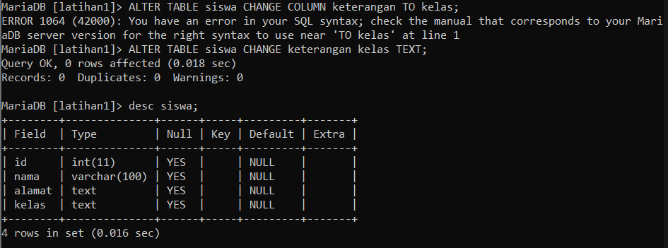
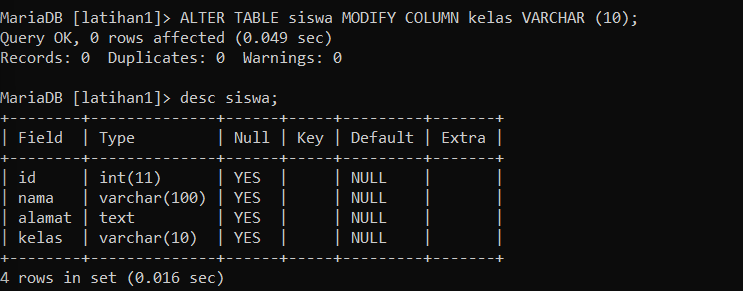
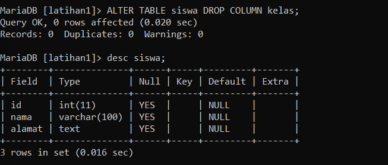
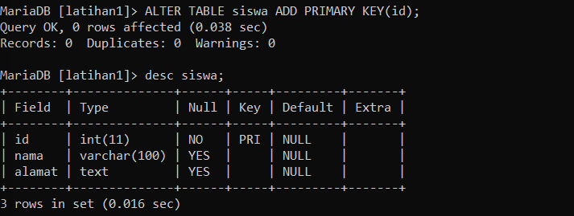
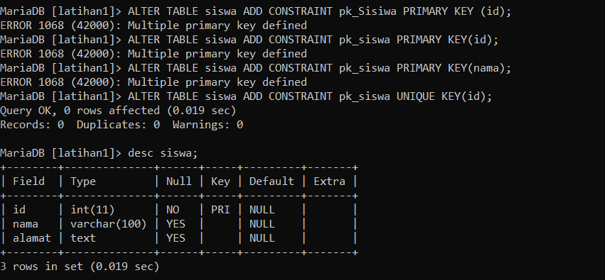
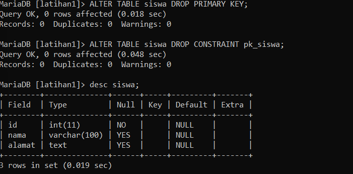

# Tugas Praktikum { Pertemuan ke 5 } 
|**Nama**|**NIM**|**Kelas**|**Matkul**|
|----|---|-----|------|
|Muhammad Ikhsan Fakhrudin|312210019|TI.22.A2|Basis Data|

# Soal Latihan Praktikum

**1. Buat sebuah database dengan nama latihan2**

Untuk membuat database gunakan perintah sebagai berikut :

`CREATE DATABASE [nama_database]`

`CREATE DATABASE latihan2;`

lalu, setelah kita membuat database. kita masuk kedalam database tersebut dengan perintah sebagai berikut :

`USE latihan2;`

**2. Buat sebuah tabel dengan nama biodata (nama, alamat) didalam database latihan2!**

Untuk membuat Tabel gunakan perintah sebagai berikut :

`CREATE TABLE nama_tabel (nama_field1 tipe _data(ukuran), nama_field2 tipe_data(ukuran), ..., nama_fieldn tipe_data(ukuran));`

`CREATE TABLE biodata (nama VACHAR (15), alamat TEXT);`

**3. Tambahkan sebuah kolom keterangan (varchar 15), sebagai kolom terakhir!**

Untuk menambahkan kolom terakhir yaitu dengan sering digunakan kata AFTER, contoh :

`ALTER TABLE biodata ADD COLUMN keterangan VARCHAR (15) AFTER phone;`

**4.Tambahkan kolom id(int 11) di awal (sebagai kolom pertama)!**

Untuk menambahkan kolom pertama yaitu dengan perintah sebagai berikut :

`ALTER TABLE biodata ADD COLUMN id int(11) FIRST; `

**5. Sisipkan sebuah kolom dengan nama phone (varchar 15) setelah kolom alamat!**

Untuk menambahkan kolom setelah kolom lain yaitu dengan perintah `AFTER`

**6. Ubah tipe data kolom id menjadi char(11)!**

Untuk mengubah type data yaitu dengan perintah sebagai berikut :

`ALTER TABLE [nama_tabel] MODIFY nama_field tipe_data_baru(ukuran);`

**7. Ubah nama kolom phone menjadi hp (varchar 20)!**

Untuk mengubah kolom yaitu dengan perintah sebgai berikut :

`ALTER TABLE [nama_tabel] CHANGE nama_field_lama nama_field_baru tipe_data(ukuran);`

**8. Tambahkan kolom email setelah kolom hp**

**9. Hapus kolom keterangan dari tabel!**

Untuk menghapus kolom dari tabel yaitu dengan perintah sebagai berikut :

`ALTER TABLE [nama_tabel] DROP nama_field;`

**10. Ganti nama tabel menjadi data_mahasiswa!**

Untuk mengganti nama tabel yaitu dengan perintah sebagai berikut :

`ALTER TABLE [nama_tabel] RENAME [nama_tabel_baru];`

**11. Ganti nama field id menjadi nim!**

**12. Jadikan nim sebagai PRIMARY KEY!**

Untuk menambahkan index atau key, gunakan perintah sebagai berikut :

tipe index :

- PRIMARY KEY
- UNIQUE KEY
- FULLTEXT

`ALTER TABLE [nama_tabel] ADD [INDEX|PRIMARY KEY] (nama_field);`

**13. Jadikan kolom email sebagai UNIQUE KEY!**

Perintah nya sama seperti diatas, hanya saja diganti menjadi `UNIQUE KEY`

# Evaluasi Dan Pertanyaan

**Tulis semua perintah-perintah SQL percobaan di pdf praktikum 1 beserta outputnya!**

SQL DDL

**Membuat Database**

`CREATE DATABASE latihan1;`

**Membuat Tabel**

`CREATE TABLE siswa (nama VARCHAR (100), alamat TEXT);`

**Menambah Kolom**

`ALTER TABLE biodata ADD COLUMN ketengan TEXT AFTER alamat;`

Di perintah yang bapak kasih ada kesalahan yaitu di nama tabelnya. seharusnya siswa bukan biodata.

**Menambah kolom diawal**

`ALTER TABLE siswa ADD COLUMN id INT FIRST;`

**Mengubah nama kolom**

`ALTER TABLE siswa CHANGE COLUMN keterangan TO kelas;`

Diperintah ini ada kesalahan, seharusnya yang benar yaitu ini ALTER TABLE siswa CHANGE keterangan kelas TEXT;

**Mengubah tipe data**

`ALTER TABLE siswa MODIFY COLUMN kelas VARCHAN(10);`

**Menghapus kolom**

`ALTER TABLE siswa DROP COLUMN kelas;`

**Menambah PRIMARY KEY**

`ALTER TABLE siswa ADD PRIMARY KEY(id);`

**Menambah CONSTRAINT**

`ALTER TABLE siswa ADD CONSTRAINT pk_sisiwa PRIMARY KEY(id);`

Disini sebenarnya tidak bermasalah jika PRIMARY KEY nya kita hapus terlebih dahulu. Jadinya saya coba ganti `PRIMARY KEY` dengan `UNIQUE KEY.`

**Menghapus PRIMARY KEY**

`ALTER TABLE siswa DROP PRIMARY KEY;`

**Menghapus CONSTRAINT**

`ALTER TABLE siswa DROP CONSTRAINT pk_siswa;`

## Apa Maksud Dari INT(11) ?

- INT(11) Adalah Nama Tipe Datanya Yaitu `Integer` dan Memiliki Panjang 11 Karakter.

## Ketika Kita Melihat Struktur Tabel Dengan Perintah DESC , Ada Kolom Null yang Berisi Yes dan No. Apa Maksudnya ?

- Yaitu Untuk Menjelaskan Bahwa Pada Record yg `NO` Harus diisi , Sedangkan `YES` Boleh Tidak diisi.

### Sekian Tugas Praktikum Saya di Pertemuan kali ini. Jika Masih Ada Yang Salah Saya Mohon Maaf.

### Wassalamualaikum wr.wb. 